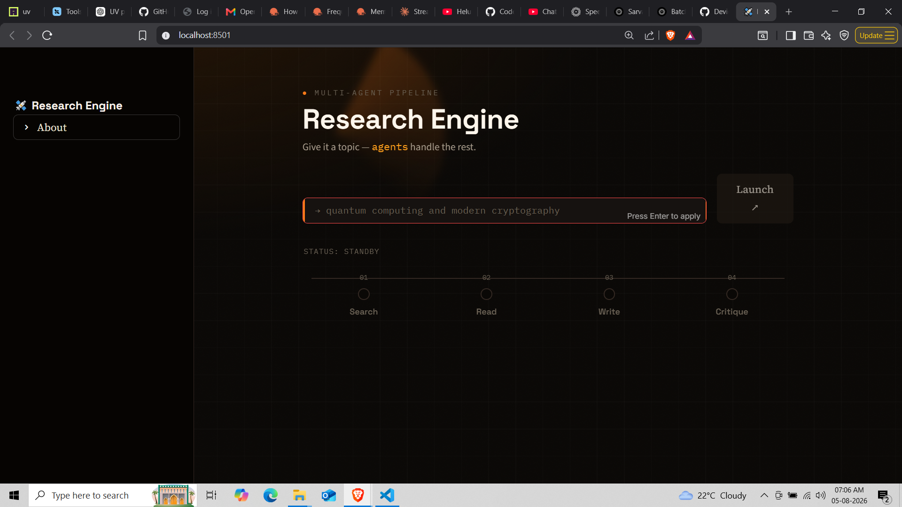
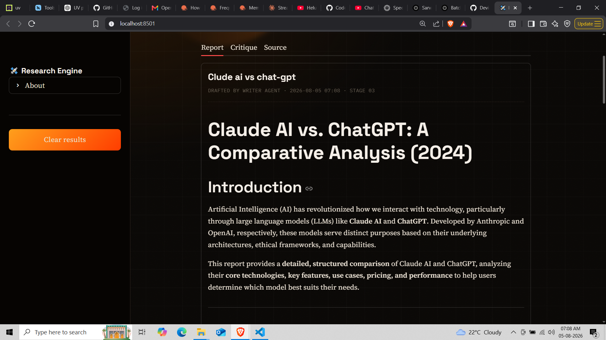

# 🔬 ResearchMind AI

> **An Autonomous Multi-Agent AI Research Assistant built with LangGraph, LangChain, Mistral AI, and Tavily Search.**

ResearchMind AI is an intelligent research automation system that mimics how a human researcher works. Instead of relying on a single LLM prompt, it orchestrates multiple specialized AI agents that collaborate to search the web, read relevant sources, write detailed reports, and critique the final output.

---

## 🚀 Features

- 🔎 AI-powered Web Search
- 🌐 Automatic URL Selection
- 📖 Intelligent Web Scraping
- ✍️ AI Report Generation
- 🧐 AI Critique & Quality Review
- 🔄 Multi-Agent Workflow
- ⚡ Built using LangGraph
- 🧠 Powered by Mistral AI
- 🌍 Real-time Internet Research

---

## 🏗️ Architecture

```text
                User Topic
                     │
                     ▼
           🔎 Search Agent
                     │
                     ▼
        🌐 Tavily Search Results
                     │
                     ▼
            📖 Reader Agent
                     │
         Scrapes Best Web Source
                     │
                     ▼
            ✍️ Writer Agent
                     │
      Generates Research Report
                     │
                     ▼
            🧐 Critic Agent
                     │
      Reviews & Improves Report
                     │
                     ▼
              Final Output
```

---

## 🧠 AI Agents

### 🔎 Search Agent

- Searches the internet
- Finds recent and reliable sources
- Returns relevant search results

---

### 📖 Reader Agent

- Chooses the most relevant webpage
- Extracts important information
- Removes unnecessary content

---

### ✍️ Writer Agent

- Combines search results
- Uses scraped information
- Produces a structured research report

---

### 🧐 Critic Agent

- Reviews report quality
- Checks completeness
- Identifies missing information
- Suggests improvements

---

## 🛠️ Tech Stack

| Technology | Purpose |
|------------|---------|
| Python | Backend |
| LangGraph | Multi-Agent Orchestration |
| LangChain | LLM Framework |
| Mistral AI | Language Model |
| Tavily Search | Web Search |
| BeautifulSoup | Web Scraping |
| Requests | HTTP Requests |

---

## 📂 Project Structure

```text
ResearchMind-AI/

│── app.py
│── pipeline.py
│── agents.py
│── requirements.txt
│── README.md

```

---

## ⚙️ Installation

Clone the repository

```bash
git clone https://github.com/YOUR_USERNAME/ResearchMind-AI.git

cd ResearchMind-AI
```

Create a virtual environment

```bash
python -m venv .venv
```

Activate it

Windows

```bash
.venv\Scripts\activate
```

Linux / macOS

```bash
source .venv/bin/activate
```

Install dependencies

```bash
pip install -r requirements.txt
```

---

## 🔑 Environment Variables

Create a `.env` file

```env
MISTRAL_API_KEY=your_key_here
TAVILY_API_KEY=your_key_here
```

---

## ▶️ Run

```bash
streamlit run app.py
```

or

```bash
python pipeline.py
```

---

## 📊 Example Workflow

Input

```
Topic:
Future of Artificial Intelligence in Healthcare
```

Output

```
🔎 Search Results

↓

📖 Web Scraping

↓

✍️ Research Report

↓

🧐 AI Critique

↓

✅ Final Research
```

---

## 🌟 Future Improvements

- PDF Research Export
- Citation Generation
- Multi-source Research
- Research Memory using Vector Database
- Research Chat (RAG)
- Research Comparison
- Streaming Responses
- Image & Chart Generation

---

## 📌 Why This Project?

Traditional chatbots answer questions with a single prompt.

ResearchMind AI follows a true multi-agent workflow:

- Search
- Read
- Analyze
- Write
- Review

This produces more reliable and structured research reports while demonstrating practical AI agent orchestration.

---

## 👨‍💻 Author

**Shaktiprasad Nagendra Bhat**

Backend Python Developer | AI & GenAI Enthusiast

GitHub: https://github.com/shaktinbhat

---

## ⭐ Support

If you found this project useful, consider giving it a ⭐ on GitHub.


## Screenshots

### Dashboard



### AI Chat

